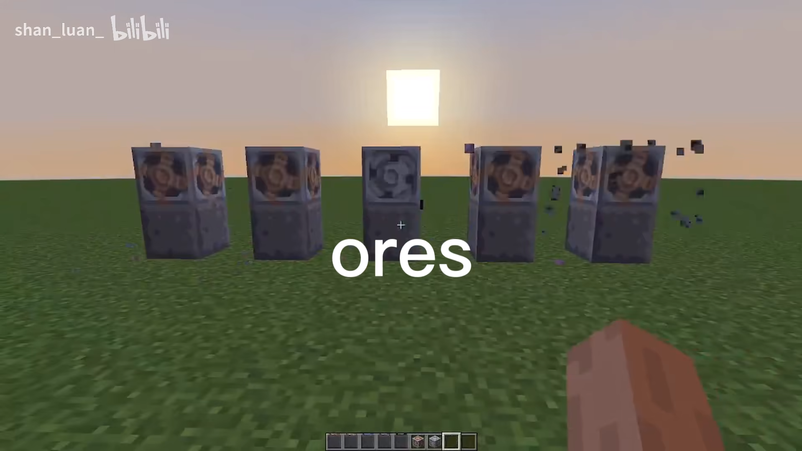

# Mindustry mod for Minecraft

    
    
    

    

[En](README.MD) | 简体中文

# 这是什么

这个Minecraft模组是关于游戏 [Mindustry](https://github.com/Anuken/Mindustry) 的模组

你可以观看此 [视频](https://b23.tv/rnAnPnZ) 以此了解本模组

# 照片

矿石

物品

流体

墙

双管炮

传送带

# 关于

Github: https://github.com/shan-luan/MindustryModForMinecraft

Bilibili: https://space.bilibili.com/1655518235

Issues: https://github.com/shan-luan/MindustryModForMinecraft/issues
